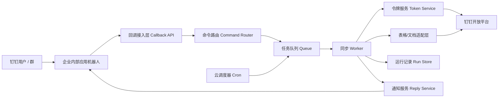

# 钉钉机器人自动同步正式版详细设计文档

## 1. 文档目标

本文档定义 `sheet-sync-web` 的正式版目标架构：基于钉钉企业内部应用与机器人能力，将当前本地运行的多分表同步逻辑迁移为云上长期运行的企业级服务。

正式版要求：

- 不依赖个人电脑运行
- 不依赖个人 `dws` 登录态
- 固定同步 5 张分表到 1 张总表
- 支持每天自动同步两次
- 支持业务侧手动触发同步
- 支持将同步结果回传到钉钉
- 支持后续由公司管理员持续维护，不因人员变动失效

## 2. 背景与现状

当前项目已完成本地可用版本，关键现状如下：

- [server.js](C:/Users/Administrator/Documents/Codex/2026-07-02/new-chat/work/sheet-sync-web/server.js) 负责本地 HTTP 服务、任务编排和结果汇总
- [dingtalk-sheet-sync-demo.js](C:/Users/Administrator/Documents/Codex/2026-07-02/new-chat/work/sheet-sync-web/dingtalk-sheet-sync-demo.js) 同时承载了
  - 同步规则核心
  - `dws` 数据读取
  - `dws` 数据写回
- [sync-config.json](C:/Users/Administrator/Documents/Codex/2026-07-02/new-chat/work/sheet-sync-web/sync-config.json) 已经具备“固定总表 + 固定分表列表”的配置形态

当前版本的主要问题：

- 依赖本机 `dws` 认证
- 依赖本地 Windows 运行环境
- 没有云上调度能力
- 没有钉钉机器人消息入口
- 没有企业级密钥管理、并发锁、运行审计

## 3. 正式版范围

### 3.1 目标范围

- 企业内部应用承载机器人能力
- 云上 Node 服务作为唯一执行入口
- 基于企业应用 `AppKey/AppSecret` 获取应用令牌
- 通过钉钉表格/文档 OpenAPI 读写在线数据
- 固定同步计划配置
- 自动调度与手动触发共存
- 同步结果通知与运行日志沉淀

### 3.2 非目标范围

- 不支持用户在消息里动态指定源表、目标表
- 不支持用户修改字段映射
- 不支持多租户、多企业复用
- 不在第一期内实现复杂审批流

## 4. 业务规则

### 4.1 固定同步对象

使用固定计划 `daily_master_sync`：

- 5 张分表
- 1 张总表
- 配置由系统维护，不由业务用户输入
- 后续如需调整分表或总表，由研发或运维修改服务端配置并重新发布
- 不提供任何面向业务用户的配置修改入口

### 4.2 同步字段规则

复用现有逻辑：

- 匹配主键：`货号`
- 当前字段映射来源于 [dingtalk-sheet-sync-demo.js](C:/Users/Administrator/Documents/Codex/2026-07-02/new-chat/work/sheet-sync-web/dingtalk-sheet-sync-demo.js)
- 空值覆盖规则：保留现有 `allowEmptyOverwrite`

### 4.3 调度规则

时区统一为 `Asia/Shanghai`

每天执行 2 次：

- `12:00`
- `00:00`

说明：

- “24:00”在调度系统中落地为次日 `00:00`

### 4.4 手动触发规则

允许具备目标总表编辑权限的用户手动触发：

- `手动同步`
- `预览同步`
- `最近同步记录`
- `同步帮助`

权限判定规则：

- 不再单独维护人工白名单
- 以固定同步计划对应的目标总表作为权限基准
- 当前钉钉用户如果具备该目标总表的编辑权限，则允许手动触发同步
- 如果用户只有查看权限或无权限，则拒绝手动触发
- `最近同步` 和 `同步帮助` 第一版也沿用同一权限模型，避免信息外泄

默认假设：

- “该表格”指固定计划中的目标总表
- 后续如业务要求，也可以扩展为“任一参与同步表格的可编辑用户均可触发”，但不作为第一期默认规则

### 4.5 分表空白确认规则

当手动同步前检测到分表映射目标列存在空白单元格时，进入二次确认流程。

触发条件：

- 分表参与同步的映射列中存在空白单元格
- 这些空白值会参与本次同步判断
- 当前触发方式为 `manual`

机器人提示文案：

- `分表目标列存在空白单元格，是否仍要同步`

用户响应规则：

- 用户回复 `是`，继续执行同步
- 用户回复 `否`，终止同步流程
- 超过确认时限未回复，自动终止本次手动同步

自动同步规则：

- 定时任务无法等待人工确认
- 自动同步遇到同类空白风险时，默认 `终止并告警`
- 终止后向通知对象推送“因分表目标列存在空白单元格而未执行同步”

### 4.6 机器人默认提示页

打开机器人后，默认展示提示页面，内容包括：

- 上次同步时间：`yyyy-mm-dd hh-mm-ss`
- 下次自动同步时间：`yyyy-mm-dd hh-mm-ss`
- 操作项：`手动同步`
- 操作项：`最近同步记录`

实现目标：

- 优先使用机器人欢迎卡片、首页卡片或会话默认卡片能力
- 如果平台能力不支持“每次打开会话自动展示”，则降级为首次进入欢迎消息或固定菜单卡片

## 5. 目标架构



## 6. 逻辑分层

### 6.1 接入层

职责：

- 接收钉钉消息回调
- 校验请求合法性
- 做幂等去重
- 识别手动命令
- 将任务投递到队列

不负责：

- 直接同步
- 长耗时计算
- 直接持久化大对象

### 6.2 调度层

职责：

- 根据固定计划按时触发
- 与手动触发共享同一个任务入口
- 记录触发来源

触发来源：

- `scheduled`
- `manual`

### 6.3 领域层

职责：

- 读取计划配置
- 拉取源表与目标表
- 复用现有比对规则
- 形成写回计划
- 执行写回
- 生成运行摘要

### 6.4 集成层

职责：

- 管理 access token
- 调用钉钉表格/文档接口
- 调用机器人回消息接口

### 6.5 基础设施层

职责：

- 队列
- Redis 锁
- 数据库
- 受控配置文件
- 密钥管理
- 日志与告警

## 7. 模块设计

建议目录：

```text
src/
  app.js
  config/
    env.js
    sync-plan-repo.js
    sync-plans.json
  bot/
    callback-controller.js
    command-router.js
    reply-service.js
    home-card-service.js
    permission-guard.js
  scheduler/
    cron-runner.js
  jobs/
    queue.js
    lock-service.js
  sync/
    core.js
    sync-service.js
    report-formatter.js
  dingtalk/
    token-service.js
    api-client.js
    sheet-client.js
    doc-client.js
    robot-client.js
  storage/
    run-repo.js
    audit-repo.js
    confirmation-repo.js
```

### 7.1 `sync/core.js`

职责：

- 承接现有同步规则核心
- 纯函数化
- 不直接访问网络

建议从当前脚本迁移这些能力：

- `findHeaderRow`
- `buildRecordIndex`
- `buildSyncResult`
- 键诊断与报告汇总

### 7.2 `dingtalk/sheet-client.js`

职责：

- 根据文档/表格标识读取目标工作表数据
- 读取源工作表数据
- 将数据转换为 `sync/core.js` 所需的二维结构
- 执行批量写回

要求：

- 不暴露钉钉接口细节给业务层
- 封装重试、分页、限流和错误映射

### 7.3 `sync/sync-service.js`

职责：

- 根据 `planId` 执行完整同步
- 循环处理全部分表任务
- 产出统一 `RunResult`

伪代码：

```js
async function runSyncPlan(planId, trigger) {
  const plan = await loadPlan(planId);
  const lock = await acquireLock(planId);
  try {
    const target = await sheetClient.readTarget(plan.target);
    const results = [];
    for (const job of plan.jobs) {
      const source = await sheetClient.readSource(job.source);
      const syncResult = buildSyncResult(source.rows, target.rows, plan.rules);
      const blankRisk = detectBlankRisk(source.rows, plan.rules);
      if (blankRisk.exists && trigger.source === "manual" && !trigger.confirmed) {
        await confirmationRepo.create(planId, trigger, blankRisk);
        return buildPendingConfirmationResult(blankRisk);
      }
      if (blankRisk.exists && trigger.source === "scheduled") {
        return buildScheduledAbortResult(blankRisk);
      }
      if (!trigger.dryRun && syncResult.changes.length > 0) {
        await sheetClient.applyChanges(plan.target, syncResult);
      }
      results.push(buildJobRunResult(job, syncResult));
    }
    return summarizeRun(results, trigger);
  } finally {
    await lock.release();
  }
}
```

### 7.4 `bot/command-router.js`

职责：

- 从机器人消息正文里识别固定命令

命令映射：

- `手动同步` -> `runSyncPlan(planId, { source: "manual", dryRun: false })`
- `预览同步` -> `runSyncPlan(planId, { source: "manual", dryRun: true })`
- `最近同步记录` -> 查询最近一次运行记录
- `同步帮助` -> 返回静态说明
- `是` -> 当存在待确认同步任务时继续执行
- `否` -> 当存在待确认同步任务时取消执行

说明：

- `是/否` 只在存在待确认上下文时生效
- 没有待确认上下文时，回复引导用户使用 `手动同步` 或 `最近同步记录`

### 7.5 `bot/permission-guard.js`

职责：

- 根据钉钉消息中的用户身份判断是否具备手动触发权限
- 不维护本地白名单
- 调用钉钉权限查询接口或文档/表格权限接口，判断用户对目标总表是否有编辑权限
- 对权限结果做短时缓存，降低重复调用频率

建议策略：

- 缓存键：`sync-plan:{planId}:editor:{userId}`
- TTL：5 到 10 分钟
- 若权限接口临时失败，则返回“暂时无法校验权限，请稍后重试”，不要直接放行

### 7.6 `bot/home-card-service.js`

职责：

- 生成机器人默认提示页面
- 查询最近一次同步时间
- 计算下一次自动同步时间
- 输出两个操作按钮：`手动同步`、`最近同步记录`

建议展示字段：

- 上次同步时间
- 下次自动同步时间
- 当前计划名称
- 当前计划状态

### 7.7 `scheduler/cron-runner.js`

职责：

- 注册计划调度
- 在 `12:00` 和 `00:00` 触发任务

建议：

- 优先使用云原生调度系统调用内部接口
- 其次使用应用内 cron 作为过渡方案

## 8. 配置设计

第一期推荐将同步计划保存在服务端受控配置文件中，例如：

- `src/config/sync-plans.json`
- 或部署产物中的只读配置文件

设计原则：

- 配置允许由研发或运维修改
- 配置修改需要走代码提交或部署变更流程
- 不向业务用户提供任何 Web 页面、机器人命令或后台入口来修改配置
- 服务启动时加载配置，必要时通过重启服务或重新发布生效

推荐配置结构：

```json
{
  "planId": "daily_master_sync",
  "enabled": true,
  "timezone": "Asia/Shanghai",
  "target": {
    "node": "TARGET_NODE_OR_DOC_ID",
    "sheet": "总表"
  },
  "rules": {
    "keyColumn": "货号",
    "allowEmptyOverwrite": true,
    "columnMapping": {
      "齐色主附图完成时间": "齐色主附图完成时间",
      "A+完成时间": "A+完成日期",
      "视频完成时间": "视频完成日期"
    }
  },
  "jobs": [
    {
      "id": "branch-1",
      "label": "分表1 -> 总表",
      "source": {
        "node": "SOURCE_NODE_1",
        "sheet": "kgqie6hm"
      }
    }
  ],
  "schedule": {
    "crons": [
      "0 12 * * *",
      "0 0 * * *"
    ],
    "notifyOnSuccess": true,
    "notifyOnFailure": true
  },
  "manualTrigger": {
    "enabled": true,
    "permissionMode": "target_editors",
    "permissionTarget": {
      "type": "target_sheet",
      "node": "TARGET_NODE_OR_DOC_ID",
      "sheet": "总表"
    },
    "permissionCacheTtlSeconds": 600,
    "blankCellPolicy": {
      "manual": "confirm_then_continue",
      "scheduled": "abort_and_notify",
      "confirmationTimeoutMinutes": 10
    }
  },
  "notify": {
    "resultChats": [],
    "resultUsers": []
  }
}
```

推荐实现方式：

- 通过 `sync-plan-repo.js` 从本地配置文件加载固定计划
- 计划文件纳入版本控制
- 生产环境如需区分环境，可在部署时挂载不同配置文件
- 不提供数据库动态改配置能力作为第一期方案

## 9. 数据模型设计

### 9.1 配置存储方式

第一期推荐：

- 不使用 `sync_plans` 数据库表
- 直接读取服务端受控配置文件
- 配置文件由研发或运维维护

如果后续需要多环境、多计划、灰度发布等能力，再考虑引入数据库配置表，但仍不对业务用户开放。

### 9.2 `sync_runs`

- `run_id`
- `plan_id`
- `trigger_type`
- `trigger_user_id`
- `trigger_chat_id`
- `dry_run`
- `status`
- `started_at`
- `finished_at`
- `duration_ms`
- `summary_json`
- `error_message`

### 9.3 `sync_run_jobs`

- `run_job_id`
- `run_id`
- `job_id`
- `job_label`
- `status`
- `source_node`
- `target_node`
- `changed_cells`
- `changed_rows`
- `affected_keys`
- `report_json`
- `error_message`

### 9.4 `callback_dedup`

- `event_id`
- `event_type`
- `received_at`

用于机器人消息幂等去重。

### 9.5 `sync_confirmations`

- `confirmation_id`
- `plan_id`
- `trigger_user_id`
- `trigger_chat_id`
- `run_mode`
- `status`
- `risk_type`
- `risk_summary_json`
- `expires_at`
- `confirmed_at`
- `cancelled_at`

用途：

- 保存手动同步中的空白风险待确认状态
- 支持用户回复 `是/否` 后继续或终止流程

## 10. 内部接口设计

### 10.1 机器人回调入口

`POST /api/dingtalk/callback`

用途：

- 接收钉钉机器人消息事件

处理步骤：

1. 验签
2. 去重
3. 解析会话、发言人、消息文本
4. 判断命令
5. 如为手动执行类命令，校验发言人是否具备目标总表编辑权限
6. 如命中 `是/否`，查询是否存在待确认同步任务
7. 快速响应“已受理”或“已记录确认结果”
8. 投递队列或继续待确认流程

返回：

```json
{
  "ok": true,
  "accepted": true,
  "message": "已受理，开始执行同步。"
}
```

### 10.2 手动内部触发接口

`POST /api/internal/sync-plans/:planId/run`

用途：

- 给云调度器调用
- 也可给内部运维面板调用

请求：

```json
{
  "triggerType": "scheduled",
  "dryRun": false
}
```

### 10.3 查询最近运行结果

`GET /api/internal/sync-plans/:planId/last-run`

### 10.4 健康检查

`GET /healthz`

### 10.5 机器人默认提示页接口

`GET /api/dingtalk/home-card`

用途：

- 生成机器人默认提示页面所需数据

返回内容：

- 上次同步时间
- 下次自动同步时间
- `手动同步` 操作
- `最近同步记录` 操作

## 11. 外部集成设计

### 11.1 应用令牌

使用企业内部应用 `AppKey/AppSecret` 换取 access token。

参考：

- [获取企业内部应用的 accessToken](https://open.dingtalk.com/document/orgapp-server/obtain-the-access_token-of-an-internal-app)

令牌策略：

- access token 缓存在内存和 Redis
- 提前刷新，不在过期瞬间刷新
- 获取失败时快速失败，不做无限重试

### 11.2 机器人消息回传

除同步结果通知外，还需要支持：

- 空白风险确认消息
- 机器人默认提示页或欢迎卡片
- 带按钮的交互卡片

用途：

- 回复手动触发结果
- 推送定时同步结果

建议支持：

- 普通文本消息
- 后续扩展消息卡片

### 11.3 表格/文档接口

原则：

- 优先使用企业应用身份直连
- 如果个别接口要求明确用户上下文，再补企业服务账号，不回退到个人 `dws`

接入要求：

- 统一封装 API Client
- 接口错误码标准化
- 读写限流与重试

## 12. 同步算法设计

### 12.1 保留部分

保留当前项目中已经验证过的业务算法：

- 表头识别
- 字段别名处理
- `货号` 匹配
- 空值覆盖控制
- 变更统计
- 缺失主键统计
- 重复主键诊断

### 12.2 替换部分

从正式版中移除：

- `execDws`
- `getSheetList`
- `fetchSheetCsv`
- `writeSheetCsv`
- `writeSheetRangeValues`

这些能力改为：

- `sheetClient.readSheetRows(...)`
- `sheetClient.applyChanges(...)`

### 12.3 空白风险预检查

在正式写回前新增空白风险检查步骤。

检查范围：

- 分表中参与字段映射的源列
- 本次同步实际涉及的记录范围
- 重点关注会导致目标列被清空的空白值

处理规则：

- `manual`：生成空白风险摘要，发送确认消息，等待用户回复 `是/否`
- `scheduled`：不进入等待，直接终止本次同步并告警

建议输出的风险摘要：

- 哪些分表存在空白风险
- 涉及哪些目标列
- 空白单元格数量
- 风险样例前 N 条

### 12.4 写回策略

第一期建议：

- 优先做“按变更单元格写回”
- 避免整表覆盖
- 降低误操作风险

写回流程：

1. 读取目标表
2. 根据源表计算差异
3. 生成变更块
4. 分批写回
5. 记录写回结果

## 13. 并发与幂等设计

### 13.1 并发锁

计划级锁：

- 锁键：`sync-plan:{planId}:running`

规则：

- 自动任务与手动任务互斥
- 运行中再次触发时，直接返回“已有同步任务运行中”

### 13.2 回调幂等

使用事件 ID 去重，避免钉钉重试导致重复执行。

### 13.3 写回幂等

同步逻辑天然具备“比对后再写”的幂等特征：

- 相同数据重复执行，不应产生新的写入

## 14. 消息文案设计

### 14.1 默认提示页面

```text
欢迎使用总表同步机器人
上次同步时间：2026-07-06 12:00:00
下次自动同步时间：2026-07-07 00:00:00

[手动同步]
[最近同步记录]
```

### 14.2 空白风险确认

```text
分表目标列存在空白单元格，是否仍要同步
请回复：是 / 否
```

### 14.3 手动触发受理

```text
已受理，开始执行同步。
计划：daily_master_sync
模式：正式同步
```

### 14.4 手动成功

```text
同步完成
计划：daily_master_sync
结果：5/5 个分表成功
影响货号：18
修改单元格：32
耗时：21 秒
```

### 14.5 手动失败

```text
同步失败
计划：daily_master_sync
原因：目标表无访问权限
```

### 14.6 手动取消

```text
已终止本次同步流程
原因：检测到分表目标列存在空白单元格，且用户选择不继续同步
```

### 14.7 自动通知

```text
定时同步完成
时间：2026-07-06 12:00 Asia/Shanghai
结果：5/5 个分表成功
影响货号：18
修改单元格：32
```

### 14.8 自动同步风险终止通知

```text
定时同步未执行
时间：2026-07-07 00:00 Asia/Shanghai
原因：分表目标列存在空白单元格
处理：已终止本次自动同步，请人工检查后再手动同步
```

## 15. 安全设计

### 15.1 密钥管理

- `AppSecret` 存储在云密钥管理系统
- 不写入 Git
- 不写入本地 JSON

### 15.2 权限控制

- 手动同步不再依赖人工白名单
- 手动同步仅允许目标总表的可编辑用户触发
- 权限校验以钉钉中的实时授权关系为准
- 权限校验结果可做短时缓存，但不得做长期本地固化
- 自动同步由内部调度器触发
- 内部管理接口必须走鉴权网关

推荐实现：

- 机器人收到 `手动同步` 或 `预览同步` 后，先查询消息发送者是否对目标总表拥有编辑权限
- 校验通过才入队
- 校验失败直接回复“你当前没有该总表的编辑权限，无法手动触发同步”

### 15.3 审计

记录以下信息：

- 谁触发
- 何时触发
- 手动还是自动
- 同步是否成功
- 影响哪些 job
- 失败原因

## 16. 日志与监控

### 16.1 日志分类

- 接入日志
- 回调验签日志
- 任务生命周期日志
- 表格接口调用日志
- 同步摘要日志

### 16.2 指标

- 同步成功率
- 平均耗时
- 每次影响单元格数
- 钉钉 API 调用失败率
- 回调重复率

### 16.3 告警

- 连续 2 次定时同步失败
- access token 获取失败
- 目标表写回失败
- 调度器漏触发

## 17. 部署设计

### 17.1 运行环境

推荐：

- 云主机或容器服务
- Node.js LTS
- Redis
- MySQL 或 PostgreSQL

### 17.2 部署组件

- `api-service`
- `worker-service`
- `scheduler`
- `redis`
- `db`

### 17.3 网络要求

- API 服务具备公网 HTTPS 回调地址
- Worker 可访问钉钉开放平台 API

## 18. 实施阶段

### Phase 1：同步核心拆分

- 从当前脚本抽离 `sync/core.js`
- 保留现有字段规则
- 单测覆盖本地样例
- 新增受控配置文件读取逻辑

### Phase 2：钉钉 API 适配

- 接入 access token 获取
- 封装表格/文档读写客户端
- 用测试表验证读写正确性

### Phase 3：任务与调度

- 建队列
- 建锁
- 建待确认状态存储
- 接入自动调度
- 接入运行记录表

### Phase 4：机器人接入

- 回调验签
- 命令解析
- 默认提示页卡片
- 编辑权限校验
- 空白风险确认交互
- 手动触发
- 回消息

### Phase 5：上线准备

- 密钥迁移
- 编辑权限控制联调
- 固定计划配置评审与锁定
- 测试群灰度
- 生产告警配置

## 19. 测试设计

### 19.1 单元测试

- 表头识别
- 主键匹配
- 空值覆盖逻辑
- 重复主键处理
- 报告统计正确性

### 19.2 集成测试

- access token 获取
- 读取分表
- 读取总表
- 写回目标表
- 回调消息触发
- 机器人结果发送

### 19.3 UAT

- 打开机器人默认提示页展示验证
- 默认提示页中的上次同步时间和下次自动同步时间展示验证
- 默认提示页按钮 `手动同步`、`最近同步记录` 跳转验证
- 定时任务在 `2026-07-06 12:00` 等指定时间触发验证
- 手动同步命令验证
- 手动同步遇到空白单元格时的确认提示验证
- 用户回复 `是` 后继续同步验证
- 用户回复 `否` 后终止同步验证
- 自动同步遇到空白单元格时终止并通知验证
- 具备目标总表编辑权限的用户手动触发验证
- 不具备目标总表编辑权限的用户拦截验证
- 并发触发冲突验证
- 失败通知验证

## 20. 风险与待确认项

### 20.1 风险

- 钉钉表格/文档接口的读写能力与当前 `dws` 能力不完全一致
- 个别接口可能存在应用权限不足或用户态约束
- 目标表写入频率较高时可能触发限流
- 机器人“每次打开即展示默认提示页面”的能力可能受平台卡片能力约束，需准备降级方案

### 20.2 待确认项

- 正式版所需的具体表格/文档权限点清单
- 机器人消息回调的准确事件类型与字段映射
- 结果通知发送到固定群还是仅回触发会话
- 是否需要“预览同步”命令上线到生产群
- 目标总表编辑权限的查询接口与字段模型在当前企业内部应用权限范围内是否可直接获取
- 机器人默认提示页面是否能在“每次打开会话”时自动刷新，还是仅能在首次进入或点击卡片时刷新

## 21. 结论

正式版推荐方案为：

- 固定同步计划
- 固定计划由服务端配置文件维护
- 云上长期运行
- 企业内部应用身份鉴权
- 自动调度 + 手动触发共存
- 机器人仅作为入口与通知通道

该方案能够解决当前版本最核心的 4 个问题：

- 摆脱个人电脑
- 摆脱个人 `dws`
- 支持定时自动化
- 支持公司级持续运维

## 22. 参考资料

- [钉钉开放平台](https://open.dingtalk.com/)
- [获取企业内部应用的 accessToken](https://open.dingtalk.com/document/orgapp-server/obtain-the-access_token-of-an-internal-app)
- [当前本地编排入口 server.js](C:/Users/Administrator/Documents/Codex/2026-07-02/new-chat/work/sheet-sync-web/server.js)
- [当前同步核心 dingtalk-sheet-sync-demo.js](C:/Users/Administrator/Documents/Codex/2026-07-02/new-chat/work/sheet-sync-web/dingtalk-sheet-sync-demo.js)
- [当前固定配置 sync-config.json](C:/Users/Administrator/Documents/Codex/2026-07-02/new-chat/work/sheet-sync-web/sync-config.json)
