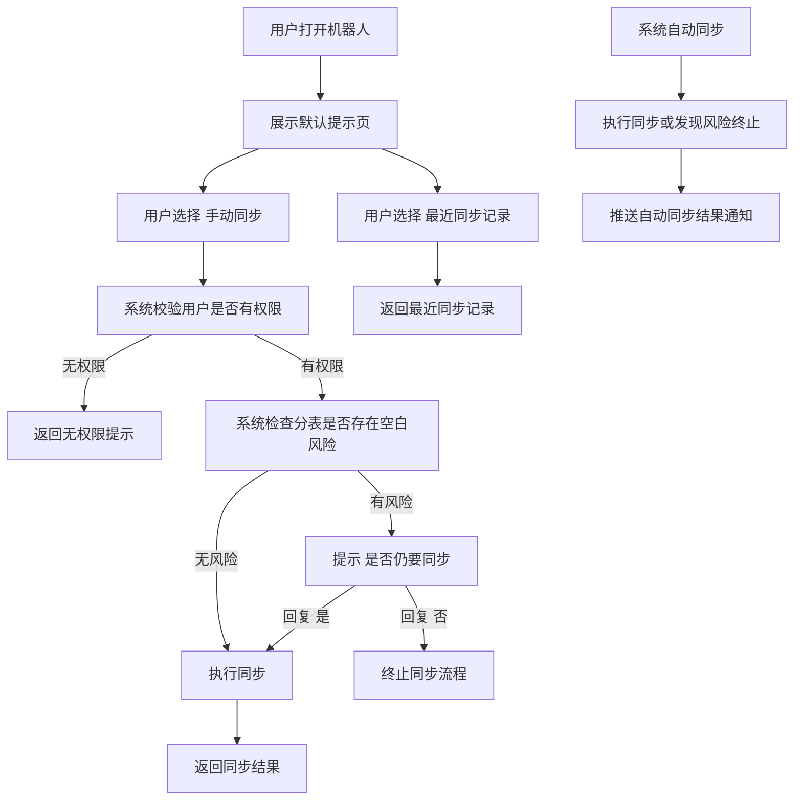

# 钉钉上线后交互方式与流程文档

## 1. 文档目标

本文档用于定义“总表同步机器人”在钉钉上线后的实际交互方式与用户使用流程。

本文档只描述：

- 用户如何进入和使用机器人
- 机器人向用户展示什么信息
- 用户在不同场景下会看到什么反馈
- 正常、异常、确认、中止等流程如何交互

本文档不描述：

- 后端技术架构
- 接口实现细节
- 数据库或部署方式

## 2. 功能定位

该机器人用于帮助业务同事在钉钉内完成“分表同步到总表”的日常操作。

核心目标：

- 让业务同事不需要线下找人执行同步
- 让同步动作在钉钉内可发起、可查看、可反馈
- 让异常情况有明确提示，避免误同步

## 3. 交互范围

第一期面向用户开放的交互范围如下：

- 打开机器人后查看默认提示页
- 查看上次同步时间
- 查看下次自动同步时间
- 手动发起同步
- 查看最近同步记录
- 在检测到空白风险时进行确认
- 查看自动同步结果通知
- 查看手动同步成功、失败、取消等反馈

第一期不面向业务用户开放：

- 自定义选择分表
- 自定义选择总表
- 修改字段映射
- 修改同步时间
- 修改白名单

## 4. 用户角色

### 4.1 可触发用户

具备目标总表编辑权限的用户，可以：

- 查看默认提示页
- 点击或发送 `手动同步`
- 点击或发送 `最近同步记录`
- 在收到空白风险确认时回复 `是` 或 `否`

### 4.2 不可触发用户

不具备目标总表编辑权限的用户：

- 可以打开机器人
- 但不能成功触发手动同步
- 点击或发送相关操作时，会收到无权限提示

## 5. 交互入口

用户进入功能的入口统一为钉钉内的机器人会话。

交互入口包括：

- 用户主动打开机器人会话
- 用户在机器人会话中点击卡片按钮
- 用户在机器人会话中发送文字指令
- 系统按计划自动执行后，机器人主动回推结果消息

## 6. 默认展示方式

用户打开机器人后，默认展示一张提示页。

默认提示页展示内容：

- 上次同步时间：`yyyy-mm-dd hh-mm-ss`
- 下次自动同步时间：`yyyy-mm-dd hh-mm-ss`
- 操作按钮：`手动同步`
- 操作按钮：`最近同步记录`

默认提示页示意：

```text
欢迎使用总表同步机器人
上次同步时间：2026-07-08 12-00-00
下次自动同步时间：2026-07-09 00-00-00

[手动同步]
[最近同步记录]
```

如果钉钉当前能力不支持“每次进入会话都自动刷新展示”，则按以下优先顺序降级：

1. 展示欢迎卡片
2. 展示固定菜单卡片
3. 展示普通欢迎文本消息

## 7. 用户可见操作

第一期面向用户的核心操作只有 2 个：

- `手动同步`
- `最近同步记录`

在特殊流程中，用户还会使用：

- `是`
- `否`

说明：

- 业务用户不需要输入分表名称或总表名称
- 业务用户不需要传任何参数
- 业务用户不需要维护配置
- 系统始终按固定的 `5` 张分表同步到固定的 `1` 张总表

## 8. 交互总流程



## 9. 具体交互流程

### 9.1 打开机器人

#### 用户动作

- 用户打开钉钉内机器人会话

#### 机器人反馈

- 展示默认提示页
- 告知上次同步时间
- 告知下次自动同步时间
- 提供 `手动同步` 与 `最近同步记录` 两个操作入口

#### 交互目标

- 用户无需学习复杂命令
- 用户打开即可知道当前同步状态
- 用户能快速进入下一步操作

### 9.2 手动同步

#### 用户动作

用户可通过两种方式发起：

- 点击 `手动同步` 按钮
- 发送文字 `手动同步`

#### 系统处理

系统收到请求后，依次做以下判断：

1. 判断当前用户是否具备目标总表编辑权限
2. 判断当前是否已有同步任务在执行
3. 检查分表目标列是否存在空白风险
4. 如果可执行，则开始本次同步

#### 机器人反馈

根据不同情况，分别给出不同提示：

- 无权限：提示不可触发
- 运行中：提示已有任务执行中
- 有空白风险：要求用户二次确认
- 正常执行：返回同步成功或失败结果

### 9.3 最近同步记录

#### 用户动作

用户可通过两种方式查看：

- 点击 `最近同步记录` 按钮
- 发送文字 `最近同步记录`

#### 机器人反馈

返回最近若干次同步记录，建议包含：

- 同步时间
- 触发方式
- 执行状态
- 成功分表数
- 修改单元格数

示意：

```text
计划：daily_master_sync
1. 2026-07-08 12-00-00 | succeeded | 5/5 | 改动 32 单元格
2. 2026-07-08 00-00-00 | aborted_blank_risk | 0/5 | 改动 0 单元格
3. 2026-07-07 12-00-00 | succeeded | 5/5 | 改动 18 单元格
```

### 9.4 空白风险确认

#### 触发条件

当用户手动同步时，如果系统检测到分表目标列存在空白单元格，则不直接继续，而是进入确认流程。

#### 机器人反馈

机器人提示：

```text
分表目标列存在空白单元格，是否仍要同步
请回复：是 / 否
```

如需增强说明，也可附带：

- 哪些分表存在空白风险
- 涉及哪些字段
- 空白单元格数量
- 样例记录

#### 用户动作

- 回复 `是`：继续执行同步
- 回复 `否`：终止同步流程

#### 超时处理

如果用户在约定时间内未回复，则本次待确认流程自动失效，不再继续执行。

### 9.5 自动同步

#### 触发时间

系统每天自动执行 2 次：

- `12:00`
- 次日 `00:00`

#### 用户无需操作

自动同步不需要业务用户发消息触发。

#### 结果反馈

自动同步完成后，机器人推送结果通知。

成功示意：

```text
定时同步完成
时间：2026-07-08 12:00 Asia/Shanghai
结果：5/5 个分表成功
影响货号：18
修改单元格：32
```

### 9.6 自动同步遇到空白风险

#### 触发条件

自动同步时，如果系统检测到分表目标列存在空白单元格，则不能等待人工确认。

#### 处理方式

- 本次自动同步直接终止
- 不继续写入总表
- 向指定会话或通知对象推送异常提示

#### 机器人反馈

```text
定时同步未执行
时间：2026-07-09 00:00 Asia/Shanghai
原因：分表目标列存在空白单元格
处理：已终止本次自动同步，请人工检查后再手动同步
```

## 10. 典型场景流程

### 10.1 场景一：正常手动同步

流程如下：

1. 用户打开机器人
2. 用户点击 `手动同步`
3. 系统校验用户有权限
4. 系统检查无空白风险
5. 系统执行同步
6. 机器人返回成功结果

成功反馈示意：

```text
同步完成
计划：daily_master_sync
结果：5/5 个分表成功
影响货号：18
修改单元格：32
耗时：21 秒
```

### 10.2 场景二：手动同步时出现空白风险

流程如下：

1. 用户打开机器人
2. 用户点击 `手动同步`
3. 系统校验用户有权限
4. 系统检测到空白风险
5. 机器人提示“是否仍要同步”
6. 用户回复 `是`
7. 系统继续执行同步
8. 机器人返回同步结果

### 10.3 场景三：手动同步时用户选择不继续

流程如下：

1. 用户发起 `手动同步`
2. 系统检测到空白风险
3. 机器人提示确认
4. 用户回复 `否`
5. 系统终止同步
6. 机器人返回取消结果

取消反馈示意：

```text
已终止本次同步流程
原因：检测到分表目标列存在空白单元格，且用户选择不继续同步
```

### 10.4 场景四：用户无权限触发手动同步

流程如下：

1. 用户发起 `手动同步`
2. 系统校验用户无目标总表编辑权限
3. 拒绝执行
4. 返回权限提示

反馈示意：

```text
你当前没有该总表的编辑权限，无法手动触发同步。
```

### 10.5 场景五：已有任务执行中

流程如下：

1. 用户发起 `手动同步`
2. 系统发现当前已有同步任务在执行
3. 不重复启动新任务
4. 返回提示

反馈示意：

```text
已有同步任务运行中，请稍后再试。
```

### 10.6 场景六：查看最近同步记录

流程如下：

1. 用户打开机器人
2. 用户点击 `最近同步记录`
3. 系统返回最近若干次执行情况

## 11. 用户指令定义

### 11.1 第一期开启指令

- `手动同步`
- `最近同步记录`
- `是`
- `否`

### 11.2 指令说明

`手动同步`

- 用于立即发起一次手动同步

`最近同步记录`

- 用于查看最近若干次同步执行结果

`是`

- 仅在收到空白风险确认后有效

`否`

- 仅在收到空白风险确认后有效

### 11.3 非上下文回复处理

如果当前不存在待确认流程，用户单独发送 `是` 或 `否`，机器人需返回引导提示。

示意：

```text
当前没有待确认的同步任务。
请先使用“手动同步”。
```

## 12. 消息文案建议

### 12.1 默认提示页

```text
欢迎使用总表同步机器人
上次同步时间：2026-07-08 12-00-00
下次自动同步时间：2026-07-09 00-00-00

[手动同步]
[最近同步记录]
```

### 12.2 成功提示

```text
同步完成
计划：daily_master_sync
结果：5/5 个分表成功
影响货号：18
修改单元格：32
耗时：21 秒
```

### 12.3 失败提示

```text
同步失败
计划：daily_master_sync
原因：请联系管理员检查同步配置或访问权限
```

### 12.4 权限不足提示

```text
你当前没有该总表的编辑权限，无法手动触发同步。
```

### 12.5 并发提示

```text
已有同步任务运行中，请稍后再试。
```

### 12.6 空白风险提示

```text
分表目标列存在空白单元格，是否仍要同步
请回复：是 / 否
```

### 12.7 取消提示

```text
已终止本次同步流程
原因：检测到分表目标列存在空白单元格，且用户选择不继续同步
```

### 12.8 自动同步成功提示

```text
定时同步完成
时间：2026-07-08 12:00 Asia/Shanghai
结果：5/5 个分表成功
影响货号：18
修改单元格：32
```

### 12.9 自动同步中止提示

```text
定时同步未执行
时间：2026-07-09 00:00 Asia/Shanghai
原因：分表目标列存在空白单元格
处理：已终止本次自动同步，请人工检查后再手动同步
```

## 13. 产品交互原则

### 13.1 简单

用户只需要看到最少的操作项：

- 手动同步
- 最近同步记录

### 13.2 明确

所有反馈都要明确告诉用户：

- 当前发生了什么
- 是否执行成功
- 为什么失败或中止
- 用户下一步该做什么

### 13.3 安全

当存在空白风险时，不直接继续执行手动同步，必须进行二次确认。

### 13.4 可追踪

用户应始终能看到：

- 上次同步时间
- 下次自动同步时间
- 最近执行记录

## 14. 验收建议

交互验收时，至少验证以下场景：

1. 打开机器人后默认提示页正确展示
2. 默认提示页中上次同步时间正确展示
3. 默认提示页中下次自动同步时间正确展示
4. 点击 `手动同步` 后正常触发
5. 点击 `最近同步记录` 后正常返回记录
6. 手动同步遇到空白风险时正确提示确认
7. 回复 `是` 后能够继续执行
8. 回复 `否` 后能够正确终止
9. 无权限用户触发时正确拦截
10. 自动同步成功时正确回推通知
11. 自动同步遇到空白风险时正确中止并告警
12. 已有任务执行中时正确提示稍后再试

## 15. 结论

钉钉上线后的交互应尽量保持“低学习成本、强结果反馈、异常可控”。

对业务同事而言，这个机器人应该表现为：

- 打开就能看到当前状态
- 点击就能执行常用操作
- 出现风险时会被明确提醒
- 执行结果能够即时回传
- 无需理解配置和技术细节

这也是第一期交互设计的核心目标。
